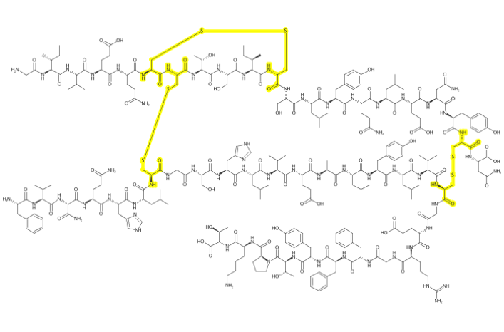

<!-- README.md is generated from README.Rmd. Please edit that file -->

```{r, echo = FALSE}
knitr::opts_chunk$set(
  collapse = TRUE,
  comment = "#>",
  fig.path = "README-"
)
```

# depict

depict is an R wrapper around the wonderful depiction api written by [John May](https://github.com/johnmay).  The entire [CDK](https://github.com/cdk) team, but especially
John, have been steadily improving the visualization features of CDK. The depiction API is
succinct and powerful and provides access to a vary large amount of the end-user desired functionality with a small number of composable functions. Because of the design of this API
it is now relatively straightforward to design a simple streamlined interface to allow users to quickly and easily generate beautiful graphics.

## Installation

You can install depict from github with:

```{r gh-installation, eval = FALSE}
# install.packages("devtools")
devtools::install_github("CDK-R/depict")
```

## Example

```{r setup, include=FALSE}
knitr::opts_chunk$set(echo = TRUE)
suppressMessages(library(depict))
suppressMessages(library(magrittr))
suppressMessages(library(grid))
```

## Simple Depiciton

A simple wrapper around cdk's excellent depict module.

```{r warning=FALSE, message=FALSE, eval=FALSE}
library(depict)
library(magrittr)
library(grid)

# you must supply java colors 
color <- J("java.awt.Color")

# load in penicillin
pen  <- parse_smiles("CC1(C(N2C(S1)C(C2=O)NC(=O)CC3=CC=CC=C3)C(=O)[O-])C penicillin")
cav  <- parse_smiles("CN1C=NC2=C1C(=O)N(C(=O)N2C)C")

# define the regions to highlight
# either all atoms/bonds
# or a SMARTS-defined subregion
atms <- pen$atoms()
bnds <- pen$bonds()
lactam <- match_smarts("C1(=O)NCC1", pen)

# use piping to change the behavior as desired
depiction() %>%
  highlight_atoms(atms, color$LIGHT_GRAY) %>%
  highlight_atoms(bnds, color$LIGHT_GRAY) %>%
  highlight_atoms(lactam, color$RED) %>%
  set_size(400, 400) %>%
  set_zoom(3) %>%
  outerglow() %>%
  add_title() %>%
  depict(pen) %>%
  get_image() %>%
  grid::grid.raster()

```


## A Larger Example


```{r message=FALSE, eval=FALSE}
insulinmol <- system.file("molfiles/ChEBI_5931.mol", package="depict")
insulin    <- read_mol(insulinmol)

cysteine <- match_smarts("C(=O)C(CS)N", insulin)
xlinks   <- match_smarts("SS", insulin)

dp <- depiction()%>% 
  set_size(700, 400) %>%
  set_zoom(10) %>%
  outerglow() %>%
  highlight_atoms(cysteine, color$YELLOW) %>%
  highlight_atoms(xlinks, color$YELLOW) %>%
  depict(insulin) %>%
  get_image() %>%
  grid::grid.raster()

```


 


## Coding notes

A few notes about setup:

1. Java can be touch on OSX in particular. When in doubt try `sudo R CMD javareconf` and reinstall rJava from source.
2. Currently I am using the `$` operator in just about all of my functions. This makes it about a billion times easier and more succinct to code at the price of performance. If performance becomes an issue we can use low-level calls. If its important to you I'm happy to accept pull requests.
3. The API is still in flux. I am currently happy with the design but there are a few areas where I'd like to kick the tires a bit more - especially in regards to selection.
4. java.awt.colors are a bit tough to warp since there are many arities and classes accepted.. I think I will provide a number of colors.
5. SMARTS selectors. common smarts selections for AminoAcids, Nucleic Acids, Sugars may be worth including as well.
5. 
