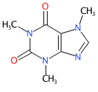
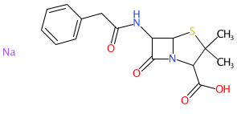
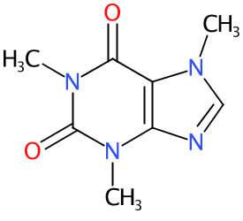
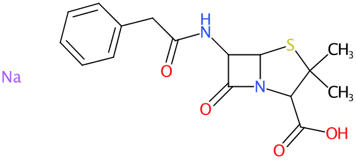
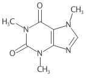
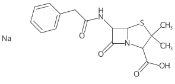

```{r setup, include=FALSE}
knitr::opts_chunk$set(echo = TRUE)
```

## CDK Depict 

A simple wrapper around rcdk's excellent depict module.

```{r warning=FALSE, message=FALSE}
library(webchem)
library(rcdk)
library(cdkdepict)
```

## Basic Depiction 

You can also embed plots, for example:

```{r message=FALSE}
# get a few smiles by name
cafsmiles  <- webchem::cir_query(c("caffeine","penicillin"), representation = "smiles")

# parse the smiles into CDK AtomContainers
caffeine   <- parse.smiles(cafsmiles$caffeine)[[1]]
penicillin <- parse.smiles(cafsmiles$penicillin)[[1]]

# depict
depict(caffeine,imgoutfile = "images/caffeine.png")
depict(penicillin,imgoutfile = "images/penicillin.png")
```





### Change the Zoom Level

```{r}
depict(caffeine,  zoom=2, imgoutfile = "images/caffeine_zoom.png")
depict(penicillin,zoom=2, imgoutfile = "images/penicillin_zoom.png")
```




### Remove the Color

```{r}
depict(caffeine,  atomcolors = FALSE, imgoutfile = "images/caffeine_BW.png")
depict(penicillin,atomcolors = FALSE, imgoutfile = "images/penicillin_BW.png")
```




```{r}
penicillin$
depict(penicillin,atomcolors = FALSE, imgoutfile = "test.png")
```
